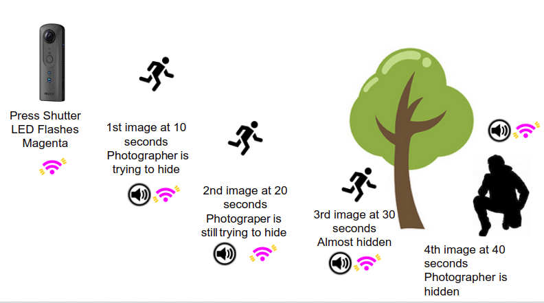
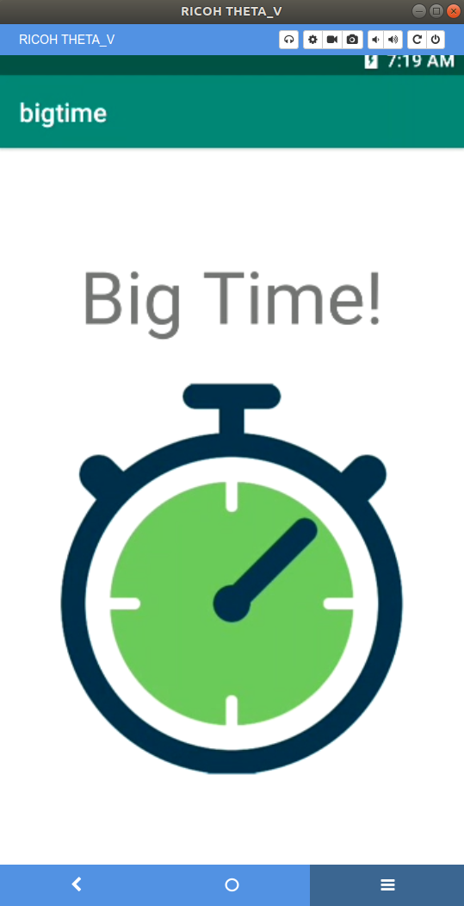

# Big Time - Self-Timer for RICOH THETA

Sets self-timer delay for longer than 5 seconds. 

## Download Finished Plug-in

[https://pluginstore.theta360.com/plugins/guide.theta360.bigtime/](https://pluginstore.theta360.com/plugins/guide.theta360.bigtime/)

## Copyright
This code was written by Matt Hotsinpillar during a dev meetup.

## Workflow

Press shutter button and automatically take 
4 shots of the same scene. Throw away 3 shots after the shoot
and keep the best one to use.

## When To Use

This is for people that don't want to use the mobile app and 
want to take a picture that doesn't include the photographer. A
typical shot might be a mountain hike where you hide behind a tree.

If you set the self-timer without the mobile app, the self-timer 
is set to 5 seconds. You will likely be in the shot. 
With Big Time, you can take 4 shots with
one button press. After the first shot, the next three shots are 
spaced out by 10 seconds intervals. This should give you enough time to 
run out of the scene.

## Features
* 4 shots at 10, 20, 30, 40 seconds
* Wi-Fi LED will flash magenta when plug-in is on
* Audio prompt will sound 2.5 seconds before shot. LED will speed up
* LED speeds up faster 1.25 seconds before shot

